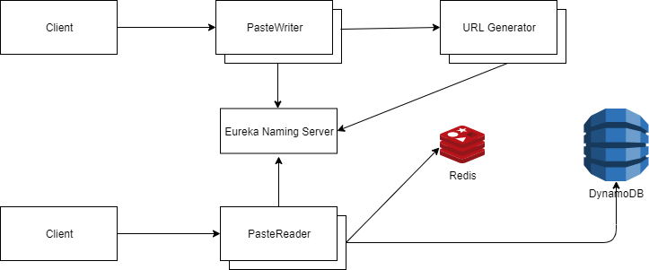

# PasteText

PasteText is a distributed web application where client can store and retrieve pastes (plain-text content) based on a unique key generated by the application. This application is designed to handle a large user base leveraging microservices architecture. The architecture diagram for this application is as follows:

 
	

There are three main services in the application as follows:

### Paste Writer Service
This microservice is responsible for writing the text based content also known as "paste" into the storage. This service in turn calls URL Generator service to generate a brand new tiny URL that is used as a unique identifier for the corresponding paste.

### Paste Reader Service
This microservice provides the API to client for retrieving the already stored "paste". It first checks the paste in the Cache and if not found it gets the content from the persistent storage i.e. DynamoDB. The recently used pastes are stored in Cache for faster retrieving.

### URL Generator Service
This microservice is responsible for generating tiny URL which acts as a key for the stored pastes. This service generates 7 character long unique alphanumeric text in constant **O(1)** time. The text is generated by using Base62 encoding and has been implemented from scratch which can produce upto **3.5 trillion** unique combinations.

All these microservices interact with each other via Netflix Eureka Naming server. Feign clients have been used for wrapping the REST calls between microservices. This project has been deployed and tested on AWS.